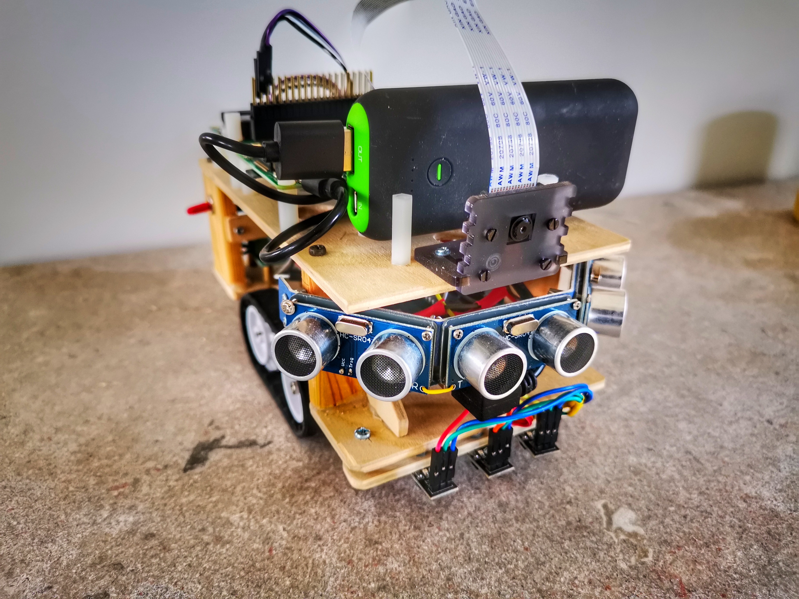
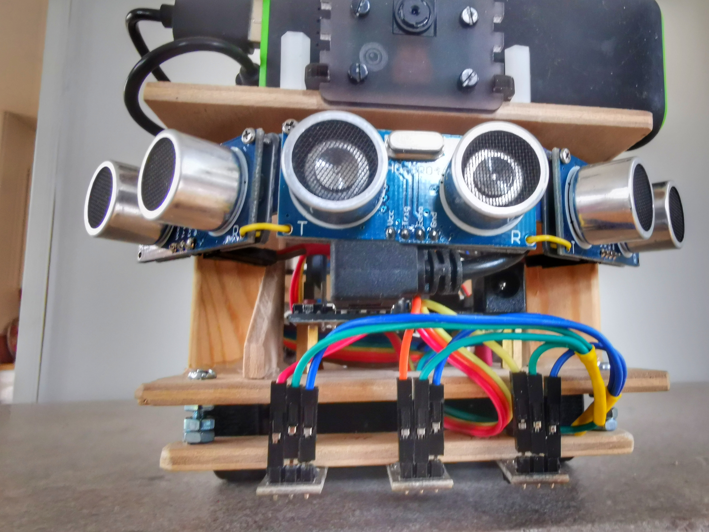
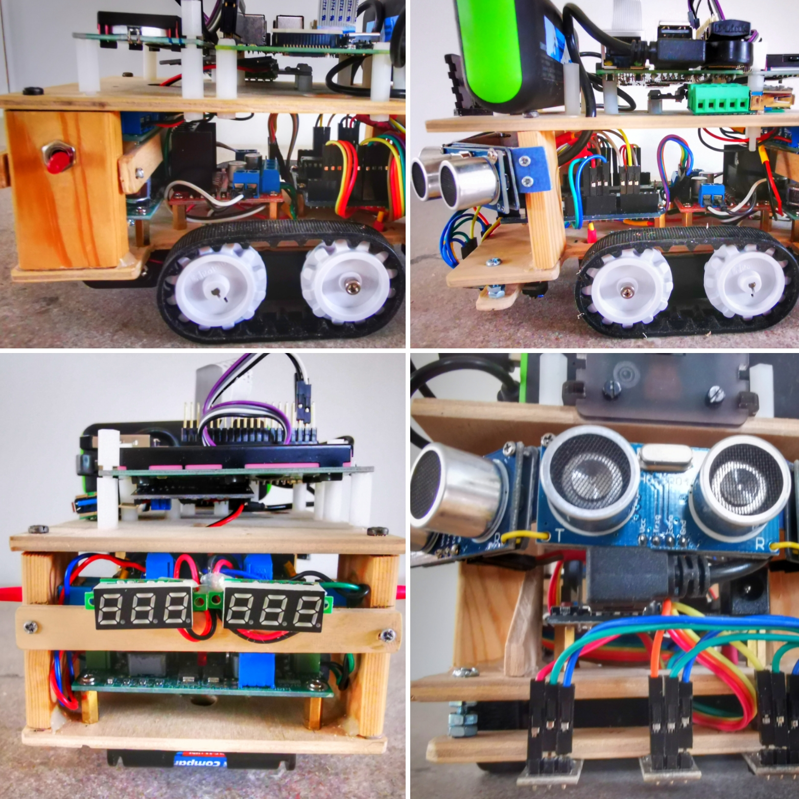
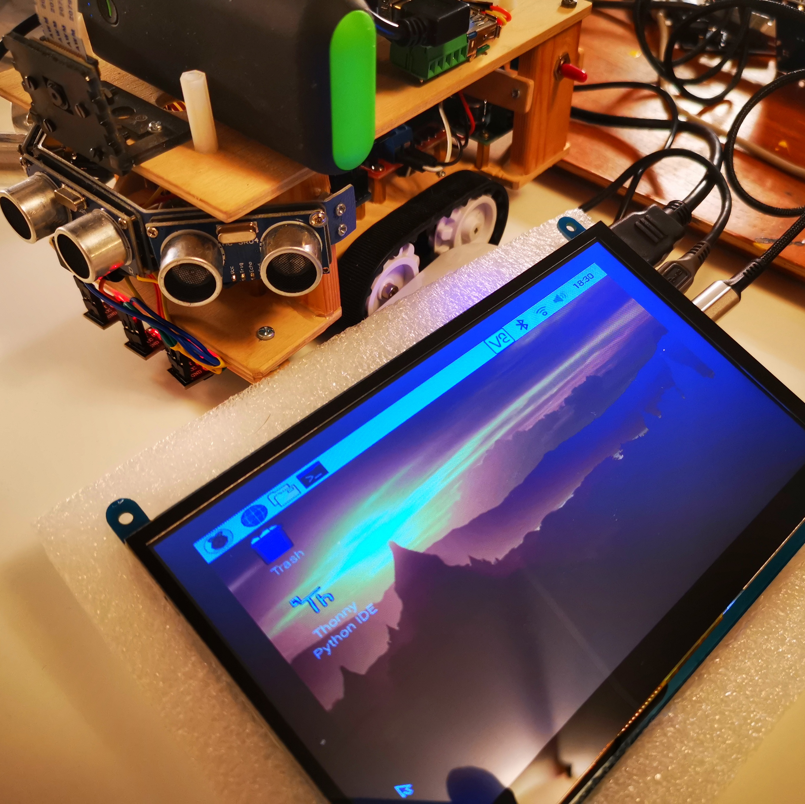
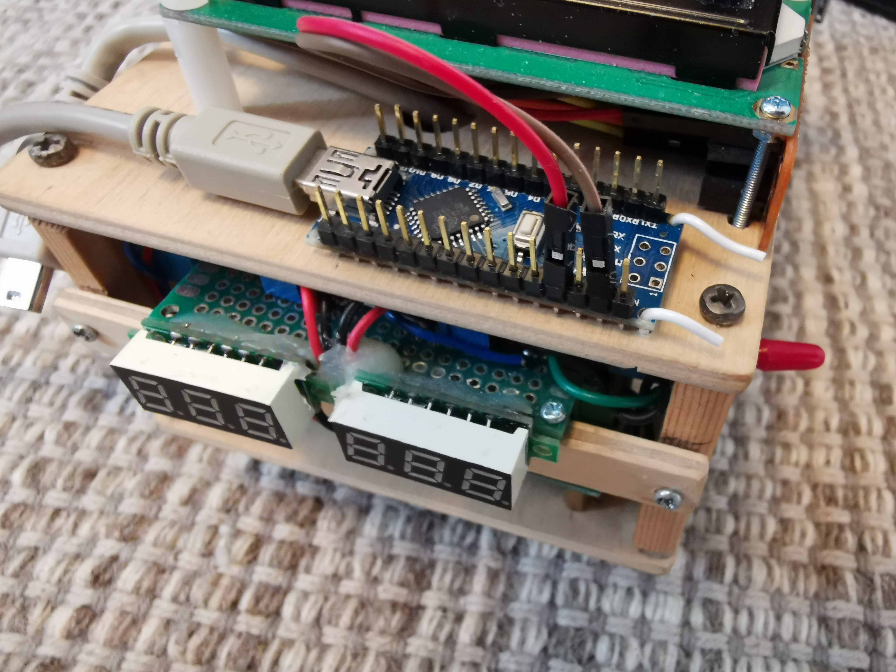
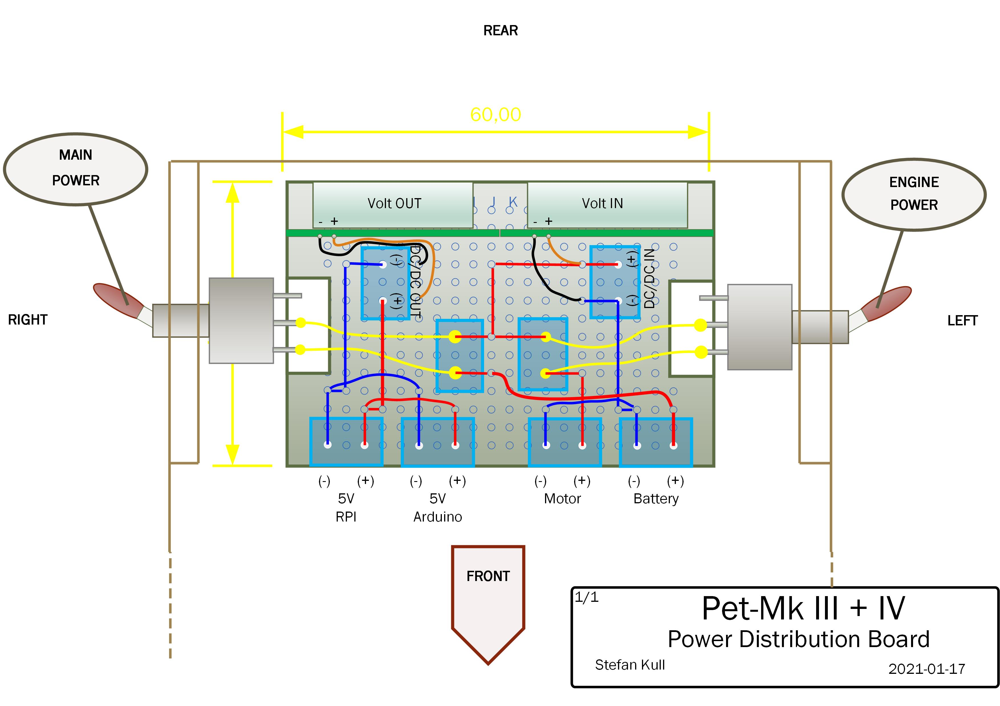

# Photo log book and image library
- **Photos:**
<table style="width:100%;background-color:#dddddd">
  <tr>
    <th>Images</th>
    <th>...from 📸 log book</th>
    <th>admirers and ponder this 🤩</th>
  </tr>
  <tr>
    <td></td>
    <td></td>
    <td></td>
  </tr>
  <tr>
    <td></td>
    <td></td>
    <td></td>
  </tr>
  <tr>
    <td></td>
    <td></td>
    <td></td>
  </tr>
   <tr>
    <td></td>
    <td></td>
    <td>
    </td>
  </tr>
  <tr>
    <td></td>
    <td></td>
    <td></td>
  </tr>
   <tr>
    <td></td>
    <td></td>
    <td></td>
  </tr>
</table>

 

- **Drawing/Schemas:**
<table style="width:100%">
  <tr>
    <th>Images</th> 
    <th>Wiring🔌diagram</th>
    <th>📑</th>
  </tr>
  <tr>
    <td> Circuit Diagram - UNO</td>
    <td> Circuit Diagram - NANO</td>
    <td> Circuit Diagram - RPi</td>
  </tr>
  <tr>
    <td> PowerDistributionSchema</td>
    <td> PowerDistributionBoard</td>
    <td></td>
  </tr>
</table>

 
 
Test images: A picture to the right (HTML formatted (48x48px))

 

<table style="width:100%">
  <tr>
    <th>1️⃣</th>
    <th>2️⃣</th>
    <th>3️⃣</th>
  </tr>
  <tr>
    <td></td>
    <td></td>
    <td></td>
  </tr>
  <tr>
    <td></td>
    <td>n/a</td>
    <td>n/a</td>
  </tr>
</table>

 

Avatar

