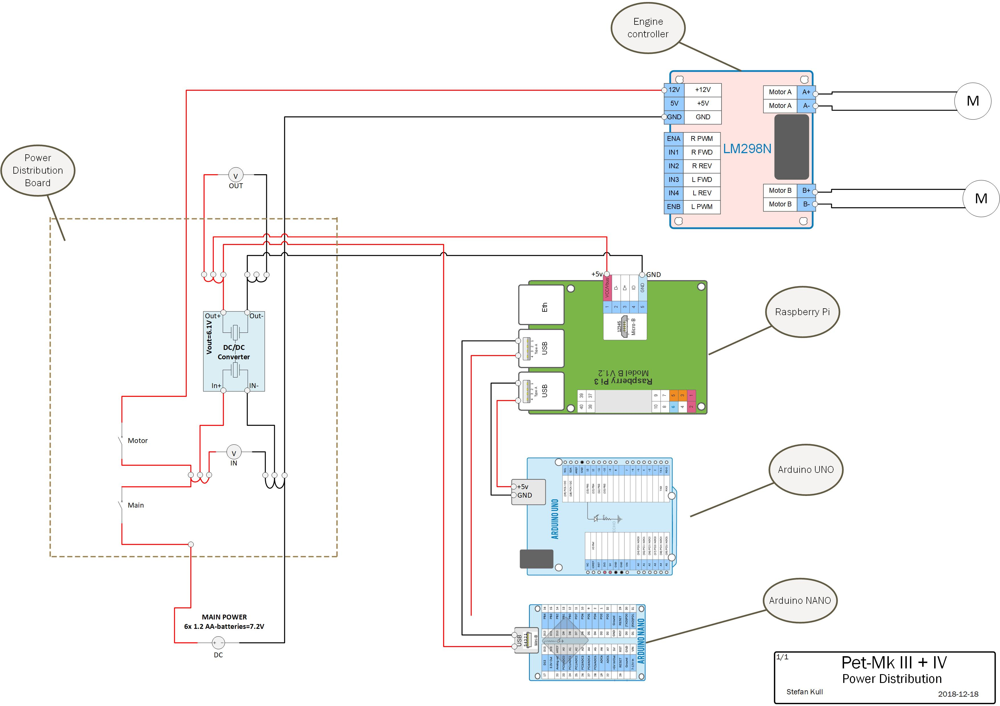

<h1 align="center">Welcome to the Pet-Mk-IV repository</h1>

ROS repository in the https://github.com/Pet-Series Git-Organizations. 
Containing multiply ROS-packages.

# Software/Setup Pet series micro robots #
The main objective/scope for this repository is to control the part of the software (and parameter settings) that is unique for this Pet Mark IV (four) robot.
<table>
    <tr>Pet-Mk.IV during developing.
      <td>
        
      </td>
      <td>
        
      </td>
    </tr>
  </table>

- **Simplification:** As MCU we mainly using Arduino compatible hardware, like Arduino UNO and Arduino NANO. 
- **Standardisation:** As system integration tool (Middle ware) we use ROS. Each MCU act as an ROS-serial device. 
- **Modularisation:** We have tried to make the code as generic/common as possible. 

# Prerequisites
### Developing workstation (PC)
 - [X] Visual Studio Code@ Local PC: https://code.visualstudio.com/
 - [X] SSH authentication vs. ECU/SBC
   

### Target Environment: Main ECU/SBC 
 - [x] Raspberry PI model 3
       Raspbian Buster (Debian Buster 10)
 - [X] ROS Melodic Ubuntu Bionic (but we compile from source anyway on the RPi/Raspbian).
 - [X] cmake for building ROS via catkin/cmake
 - [X] cmake for building Arduino firmware/sketches
 - [X] Python 2 (using various ROS-API)
 - [X] Arduino IDE (Not for the IDE itself... mainly for get/manage IDE-libraries).
 - [X] Arduino Library:
    - **ROS-serial** Library for Arduino: https://www.arduinolibraries.info/libraries/rosserial-arduino-library
    - **Servo** Library for Arduino:	https://github.com/arduino-libraries/Servo
    - **IRremote** Library for Arduino:	https://github.com/Arduino-IRremote/Arduino-IRremote
    - **NewPing** Ultrasonic sensor Library for Arduino:	https://bitbucket.org/teckel12/arduino-new-ping/wiki/
 - [X] cmake upload firmware from RPi > Arduino system  (No use of Arduino IDE)
 - [X] SSH authentication vs. Github repositories
 - [X] Clone of Git-repo:   
    1.    `$ git clone https://github.com/Pet-Series/Pet-Mk-IV.git`  <- This repo!
    1.    `$ git clone https://github.com/Pet-Series/pet_mcu_common.git`
    1.    `$ git clone https://github.com/Pet-Series/ros_lcd_driver.git`

### Target Environment: Sub-ECU/MCU #1
 - [X] Arduino UNO R3 via serial/USB-cable -> RPi
 - [X] Firmware: 
    1. https://github.com/Pet-Series/pet_mcu_common
    2. https://github.com/Pet-Series/Pet-Mk-IV/tree/master/pet_mk_iv_arduino/pet_mk_iv_uno

### Target Environment: Sub-ECU/MCU #2
 - [X] Arduino Nano via serial/USB-cable -> RPi
 - [X] Firmware: 
    1. https://github.com/Pet-Series/pet_mcu_common
    2. https://github.com/Pet-Series/Pet-Mk-IV/tree/master/pet_mk_iv_arduino/pet_mk_iv_uno

## Installing/Setup ##
    ...

## Mechanics & Hardware
- [X] **Main ECU/CPU's:** Raspberry Pi 3
  - [X] **Power by:** 1x USB Power bank 1.5A
  - [x] **Display:** LCD 1602 via I2C interface: PC8574T
  - [x] **Sensor:** IMU GY-521/MPU6050(6 axis) via I2C
  - [x] **Sensor:** Camera RPi Camera module 1.0
  - [X] **USB Power bank** 1.5A
- [X] **Sub-ECU #1:** Arduino UNO R3
  - [X] **Power by:** Via RPi (1x USB Power bank 1.5A)
  - [x] **Sensor:** 3x HC-SR04 ultrasonic ranging sensor for Obstacle detection
  - [x] **Sensor:** 3x CTRT5000 Infrared sensors for tracing
  - [x] **Engine controller:** L298N Dual H Bridge Step/DC-motor controller
- [X] **Auxiliary-ECU #2:** Arduino Nano
  - [x] **Power by:** Chassis battery pack
  - [x] **Sensor:** 1x KY-022(1838T) Infrared(IR) receiver 
  - [x] **Flash light** Flash/Strobe light
- [X] **Chassis: Zumo with belt drive**
  - [x] **Power source:** 6x AAA-batteries (4+2 config => 6*1,2V=7,2V)
  - [X] **Engines:** 2x Electrical engines (Controlled via "L298N Dual H Bridge"@Sub-ECU #1: Arduino UNO R3)

# Pictures
## Physical robot: Pet-Mk.IV in IRL
<table>
  <tr>
    <td></td>
    <td></td>
  </tr>
</table>

## Virtual robot: Pet-Mk.IV in RViz
<table>
  <tr>
    <td> View from Gazebo</td>
    <td> View from RViz</td>
    <td> View from RViz (with Links/TF<td>
  </tr>
</table>

## Drawing/Schemas:
<table>
  <tr>
    <td>
       
      Circuit Diagram - UNO
    </td>
    <td>
       
      Circuit Diagram - NANO
    </td>
    <td>
       
      Circuit Diagram - RPi
    </td>
  </tr>
  <tr>
    <td>
       
      PowerDistributionSchema</td>
    <td>
       
      PowerDistributionBoard
    </td>
      <td></td>
  </tr>
</table>
 
* More images: [/doc](doc/readme.md)

# Glossary
**Buzzword** | **My interpretation**
---------|-----------------
**ECU**	| [Electronic Control Unit](https://en.wikipedia.org/wiki/Electronic_control_unit)
**IDE** | [Integrated_Development_Environment](https://en.wikipedia.org/wiki/Integrated_development_environment)
**MCU** | [Micro Control Unit](https://en.wikipedia.org/wiki/Microcontroller)
**Pet** | Not an abbreviation. Simply names of our virtual pets (aka. Robots)
**ROS** | [Robot Operating System](https://en.wikipedia.org/wiki/Robot_Operating_System)
**ROSserial** | [core of rosserial for ROS](https://github.com/ros-drivers/rosserial)
**SBC** | [Single Board Computer](https://en.wikipedia.org/wiki/Single-board_computer)

# External references
- http://wiki.ros.org/
- http://wiki.ros.org/rosserial

For my own convenience - Some GitHub cheat sheets
- https://guides.github.com/features/mastering-markdown/
- https://help.github.com/en/github/writing-on-github/basic-writing-and-formatting-syntax
- https://www.webfx.com/tools/emoji-cheat-sheet/
